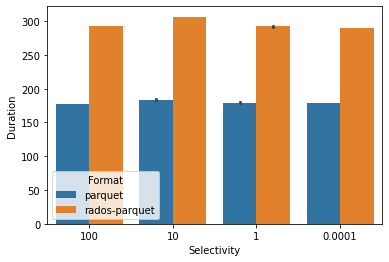
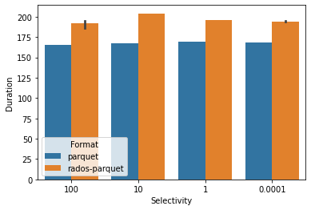
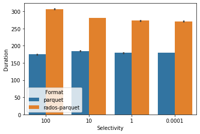
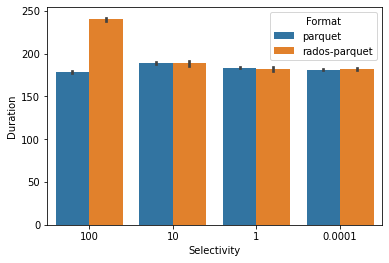
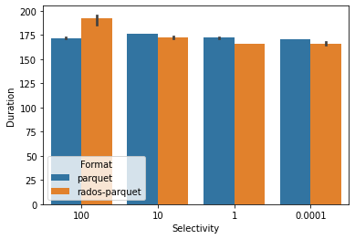

# Experiments

## 4 OSD (Baremetal ; m510 ; Cloudlab Utah)

###  Infrastructure
```
Total OSDs: 4
Total Space: 4 * 50GB = 200GB
            (OSDs * 100)
Total PGs = ------------ = 4 * 100 / 3 = ~128
             pool size  
CPUs per OSD: 16
Memory per OSD: 64 GB
Threads used in experiment: 64 (4 * 16 cores/node)
```

### Number of Rows in Files of Different Sizes
**TODO:** Do experiments with 64MB and 128MB
```
4MB: 200,000
8MB: 440,000
16MB: 800,000
32MB: 1,400,000
64MB: 2,600,000
```

### Total Rows in Dataset and Dataset Size

```
Total Rows: 1,200,000,000 (1.2 Billion)
```

#### 32 MB (1,400,000) * 860 - [OSD Slow Ops]

**Parquet**:
```
100% = [177.59175038337708, 177.4864523410797, 177.13931035995483]
10% = [184.08222556114197, 184.08177423477173, 183.8648796081543]
1% = [178.9958107471466, 179.72205305099487, 179.0966715812683]
0.0001% = [179.46223878860474, 179.18955326080322, 179.26179432868958]
```

**Rados Parquet**: 
```
100% = [293.026388133, 292.852646363, 292.279862094]
10% =  [306.5763828754425, 306.2236032485962, 306.6297423839569]
1% = [292.9455316066742, 291.83118748664856, 292.8173031806946]
0.0001% = [289.91495752334595, 290.38953709602356, 289.3467044830322]
```



#### 16 MB (800,000) * 1500 - 

**Parquet**:
```
100% = [165.43587970733643, 165.36367225646973, 165.24528217315674] 
10% = [167.65004539489746, 167.32088470458984, 167.58832144737244] 
1% = [169.13996744155884, 169.1092517375946, 169.0941984653473] 
0.0001% = [168.34860968589783, 168.1900224685669, 168.08894538879395] 
```

**Rados Parquet**: 
```
100% = 
10% =   [203.42191910743713, 203.93918442726135, 204.11645436286926] 
1% =  [196.36917161941528, 196.00127148628235, 196.3048655986786] 
0.0001% = [194.85378527641296, 194.13238525390625, 193.93808841705322] 
```



#### 8 MB (440,000) * 2780 - 

**Parquet**:
```
100% = [175.10768175125122, 174.41432166099548, 174.69665122032166] 
10% = [185.10685062408447, 184.09690976142883, 184.04355764389038] 
1% = [180.1525378227234, 179.01435112953186, 179.07738041877747] 
0.0001% = [180.14460802078247, 179.0951006412506, 179.5005223751068] 
```

**Rados Parquet**: 
```
100% = [308.189519882, 307.143620445, 305.719139636]
10% = [280.8577742576599, 281.2776508331299, 281.5891044139862]
1% = [273.14298844337463, 272.7139687538147, 273.2155878543854]
0.0001% = [272.0723671913147, 270.481018781662, 270.1696791648865]
```



#### 4 MB (200,000) * 6000 - 

**Parquet**:
```
100% = [179.22981977462769, 177.58432602882385, 177.5553960800171]
10% = [190.32088017463684, 188.51263117790222, 189.0104079246521]
1% = [184.87677526474, 183.14688372612, 183.29009532928467]
0.0001% =  [182.65148067474365, 180.70382261276245, 180.77496194839478]
```

**Rados Parquet**: 
```
100% = [242.08347446,  238.541295633]
10% = [188.29391074180603, 185.933180809021, 191.58979320526123]
1% = [179.79757499694824, 183.95941805839539, 182.32112073898315]
0.0001% = [183.33024334907532, 182.9018440246582, 181.007399559021] 
```



## 8 OSD (Baremetal ; m510 ; Cloudlab Utah)

###  Infrastructure
```
Total OSDs: 4
Total Space: 8 * 50GB = 400GB
CPUs per OSD: 16
Memory per OSD: 64 GB
Threads used in experiment: 128 (8 * 16 cores/node)
```

### 4MB (200,000) * 6000 - 
```
pq_100 = [171.36259651184082, 171.84146857261658, 172.18042612075806]
pq_10 = [176.65834045410156, 176.03858709335327, 175.93710780143738]
pq_1 = [172.4955632686615, 172.02437543869019, 171.83837342262268]
pq_smm = [170.8809368610382, 170.40378332138062, 170.41029906272888]


rpq_100 = [195.375595152, 185.851929784, 194.796275091]
rpq_10 =  [171.7900891304016, 173.7465238571167, 171.74483156204224]
rpq_1 = [166.1978645324707, 165.83843612670898, 166.07018494606018]
rpq_smm = [164.94752192497253, 165.37132954597473, 167.5552043914795]
```


