# Experiments

## 4 Node, 4 OSD (Baremetal ; m510 ; Cloudlab Utah)

###  Infrastructure
```
Total OSDs: 4
Total Space: 4 * 50GB = 200GB
            (OSDs * 100)
Total PGs = ------------ = 4 * 100 / 3 = ~128
             pool size  
CPUs per OSD: 16
Memory per OSD: 64 GB
Threads used in experiment: 64 (4 * 16 cores/node)
```

### Number of Rows in Files of Different Sizes
**TODO:** Do experiments with 64MB and 128MB
```
4MB: 200,000
8MB: 440,000
16MB: 800,000
32MB: 1,400,000
64MB: 2,600,000
```

### Total Rows in Dataset and Dataset Size

```
Total Rows: 1,200,000,000 (1.2 Billion)
```

#### 32 MB (1,400,000) * 860 - [OSD Slow Ops]

**Parquet**:
```
100% = [177.59175038337708, 177.4864523410797, 177.13931035995483]
10% = [184.08222556114197, 184.08177423477173, 183.8648796081543]
1% = [178.9958107471466, 179.72205305099487, 179.0966715812683]
0.0001% = [179.46223878860474, 179.18955326080322, 179.26179432868958]
```

**Rados Parquet**: 
```
100% = [293.026388133, 292.852646363, 292.279862094]
10% =  [306.5763828754425, 306.2236032485962, 306.6297423839569]
1% = [292.9455316066742, 291.83118748664856, 292.8173031806946]
0.0001% = [289.91495752334595, 290.38953709602356, 289.3467044830322]
```


#### 16 MB (800,000) * 1500 - 

**Parquet**:
```
100% = [165.43587970733643, 165.36367225646973, 165.24528217315674] 
10% = [167.65004539489746, 167.32088470458984, 167.58832144737244] 
1% = [169.13996744155884, 169.1092517375946, 169.0941984653473] 
0.0001% = [168.34860968589783, 168.1900224685669, 168.08894538879395] 
```

**Rados Parquet**: 
```
100% = 
10% =   [203.42191910743713, 203.93918442726135, 204.11645436286926] 
1% =  [196.36917161941528, 196.00127148628235, 196.3048655986786] 
0.0001% = [194.85378527641296, 194.13238525390625, 193.93808841705322] 
```


#### 8 MB (440,000) * 2780 - 

**Parquet**:
```
100% = [175.10768175125122, 174.41432166099548, 174.69665122032166] 
10% = [185.10685062408447, 184.09690976142883, 184.04355764389038] 
1% = [180.1525378227234, 179.01435112953186, 179.07738041877747] 
0.0001% = [180.14460802078247, 179.0951006412506, 179.5005223751068] 
```

**Rados Parquet**: 
```
100% = [308.189519882, 307.143620445, 305.719139636]
10% = [280.8577742576599, 281.2776508331299, 281.5891044139862]
1% = [273.14298844337463, 272.7139687538147, 273.2155878543854]
0.0001% = [272.0723671913147, 270.481018781662, 270.1696791648865]
```


#### 4 MB (200,000) * 6000 - 

**Parquet**:
```
100% = [179.22981977462769, 177.58432602882385, 177.5553960800171]
10% = [190.32088017463684, 188.51263117790222, 189.0104079246521]
1% = [184.87677526474, 183.14688372612, 183.29009532928467]
0.0001% =  [182.65148067474365, 180.70382261276245, 180.77496194839478]
```

**Rados Parquet**: 
```
100% = [242.08347446,  238.541295633]
10% = [188.29391074180603, 185.933180809021, 191.58979320526123]
1% = [179.79757499694824, 183.95941805839539, 182.32112073898315]
0.0001% = [183.33024334907532, 182.9018440246582, 181.007399559021] 
```


<!--
## 8 OSD (Baremetal ; m510 ; Cloudlab Utah)

###  Infrastructure
```
Total OSDs: 4
Total Space: 8 * 50GB = 400GB
CPUs per OSD: 16
Memory per OSD: 64 GB
Threads used in experiment: 128 (8 * 16 cores/node)
```

### 4MB (200,000) * 6000 - 

**Parquet**:
```
100% = [171.36259651184082, 171.84146857261658, 172.18042612075806]
10% = [176.65834045410156, 176.03858709335327, 175.93710780143738]
1% = [172.4955632686615, 172.02437543869019, 171.83837342262268]
0.0001% = [170.8809368610382, 170.40378332138062, 170.41029906272888]
```

**Rados Parquet**:
```
100% = [195.375595152, 185.851929784, 194.796275091]
10% =  [171.7900891304016, 173.7465238571167, 171.74483156204224]
1% = [166.1978645324707, 165.83843612670898, 166.07018494606018]
0.0001% = [164.94752192497253, 165.37132954597473, 167.5552043914795]
```


-->

### CPU Usage

#### Parquet

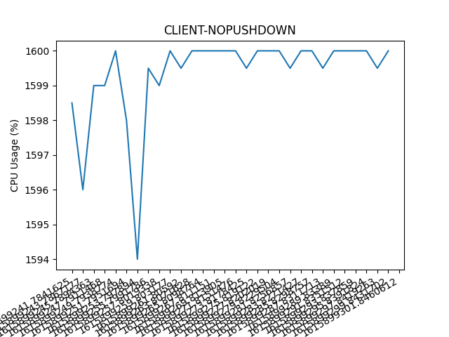

#### Rados Parquet

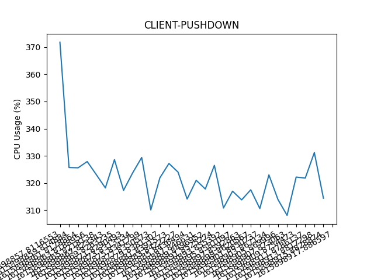
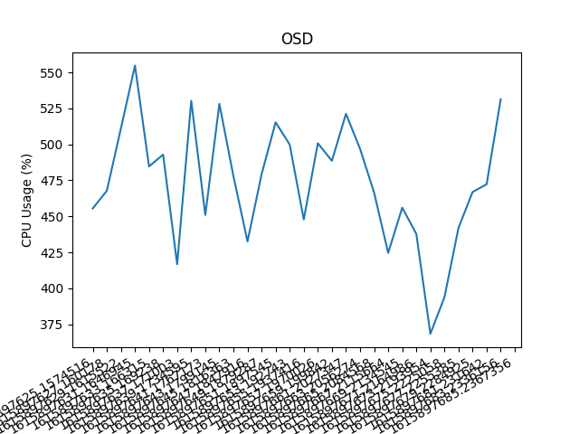


**NOTE:** On increasing the number of threads inside the OSD to 16 with `osd op threads`,
```
100% = 
10% = [152.50715136528015, 152.18096017837524, 153.30246591567993]
1% = [147.38387823104858, 147.24475741386414, 147.22748804092407]
0.0001% = [146.55077481269836, 146.39087986946106, 146.6287670135498]
```

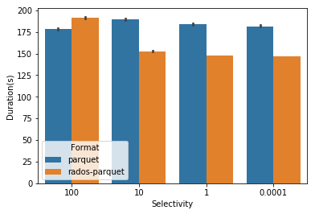

<hr> <b>With 4 OSDs per Node</b>

## 1 Node, 4 OSD, 64 threads on Client and 64 threads on OSDs

```
pq_100 = [170.754980087280273, 170.24121904373169, 170.237956523895264]
pq_10 = [183.66411137580872, 183.33817601203918, 183.3704514503479]
pq_1 = [178.45989274978638, 178.20130562782288, 178.13895440101624]
pq_smm = [176.9593644142151, 176.93329191207886, 177.18875932693481]

rpq_100 = [198.687577248, 201.240531206, 201.745352745]
rpq_10 = [201.8203809261322, 202.7355396747589, 202.02664256095886]
rpq_1 = [195.33832383155823, 194.64968729019165, 195.15813660621643]
rpq_smm = [195.0087571144104, 194.9644136428833, 194.91646361351013]
```

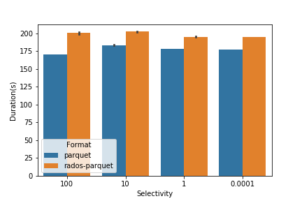
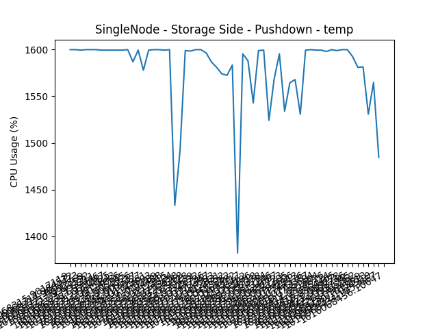
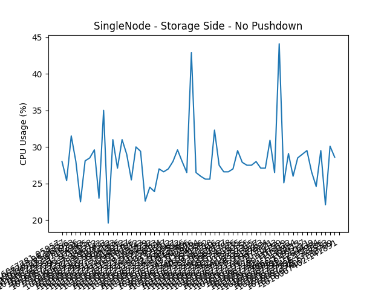
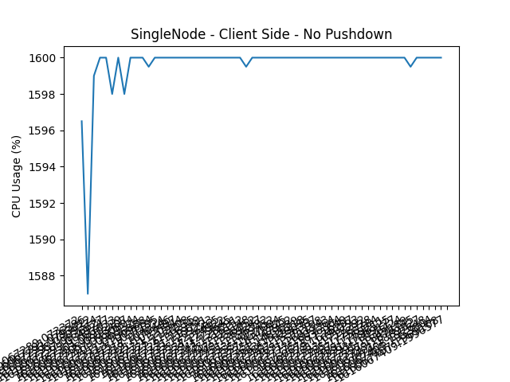
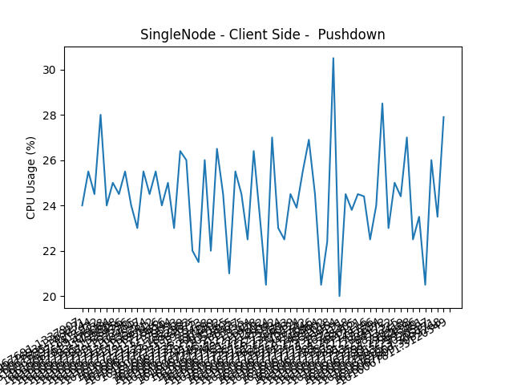

## 1 Node, 4 OSD, 64 threads on Client and 16 threads on OSDs

Same as above

## 1 Node, 4 OSD, 16 threads on Client and 16 threads on OSDs

```
rpq_100 = [220.543210745, 223.376989632, 223.937341547]
rpq_10 = [224.5243079662323, 224.15124678611755, 221.8159158229828]
rpq_1 = [217.60641503334045, 219.02979445457458, 220.6451280117035]
rpq_smm = [217.67555832862854, 216.2732195854187, 217.09133410453796]

pq_100 = [170.754980087280273, 170.24121904373169, 170.237956523895264]
pq_10 = [183.66411137580872, 183.33817601203918, 183.3704514503479]
pq_1 = [178.45989274978638, 178.20130562782288, 178.13895440101624]
pq_smm = [176.9593644142151, 176.93329191207886, 177.18875932693481]
```

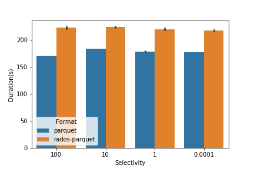
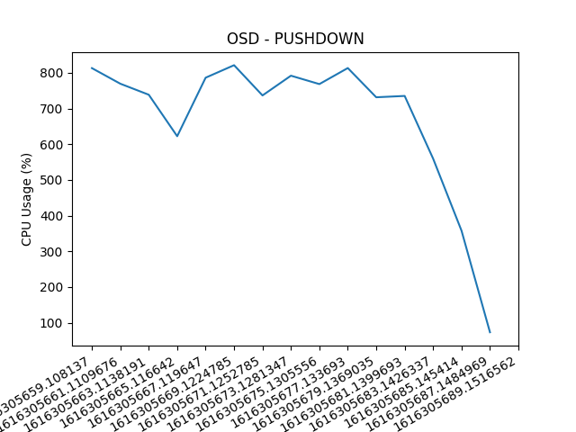
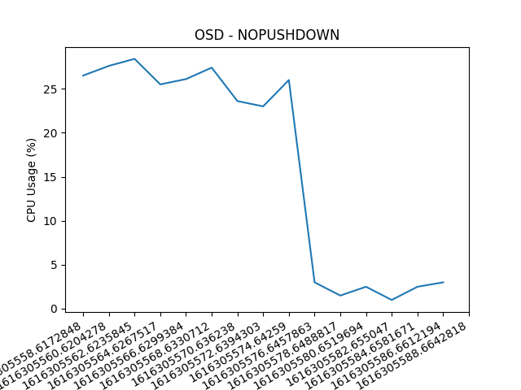
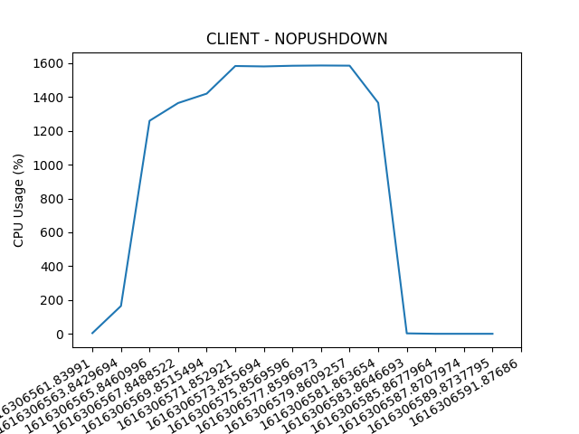
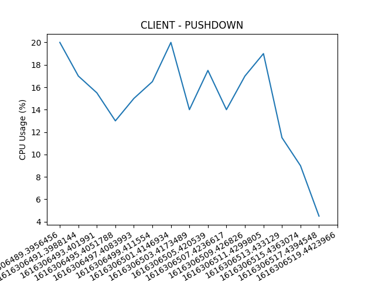


## 1 Node, 1 OSD, 64 threads on client and 16 threads on OSD
```
pq_100 = [170.759889841079712, 170.34088397026062, 170.2715961933136]
pq_10 = [182.96660947799683, 182.1477289199829, 182.60507011413574]
pq_1 = [178.0334963798523, 177.3169300556183, 177.2567789554596]
pq_smm = [176.49573183059692, 175.51851797103882, 175.54095315933228]

rpq_100 = [400.994327545166016, 402.2645788192749, 401.319567918777466]
rpq_10 = [399.8353533744812, 399.3708894252777, 398.54316449165344]
rpq_1 = [386.5476815700531, 386.9798300266266, 386.0677242279053]
rpq_smm = [384.5647027492523, 384.5121479034424, 384.25928235054016]
```

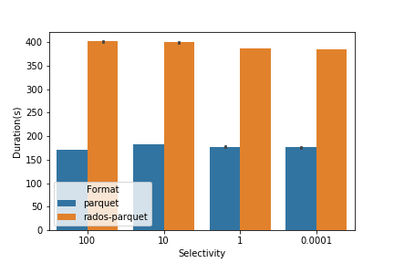
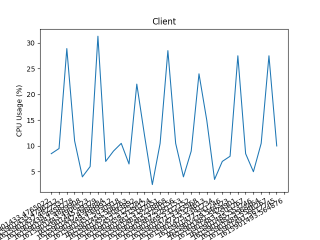
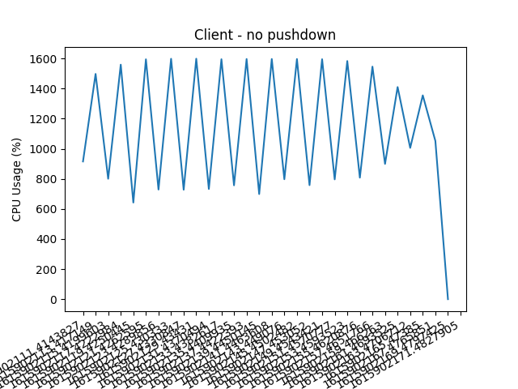
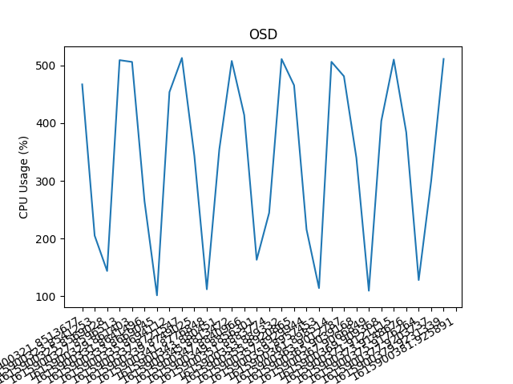

## 4 Nodes, 16 OSDs, 16 threads/osd, 64 threads on client

```
pq_100 = [178.27652978897095, 176.8193085193634, 176.88589549064636]
pq_10 = [189.35091924667358, 187.0733551979065, 187.29799938201904]
pq_1 =  [184.452538728714, 182.7997989654541, 182.86813354492188]
pq_smm = [182.98924160003662, 181.0757122039795, 180.6815700531006]

rpq_100 = [145.77922916412354, 145.9251570701599, 144.65972471237183]
rpq_10 = [90.77711272239685, 90.48544764518738, 90.60782980918884]
rpq_1 = [87.90010833740234, 88.6088764667511, 87.41672682762146]
rpq_smm =  [86.64625835418701, 87.04030799865723, 86.70620584487915]
```

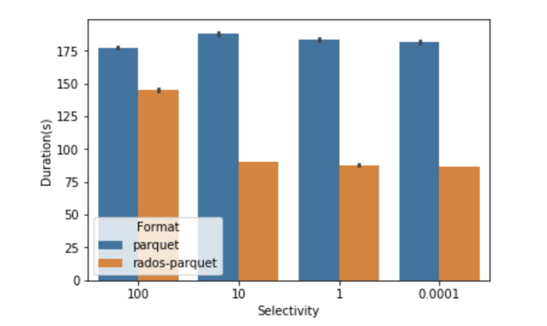
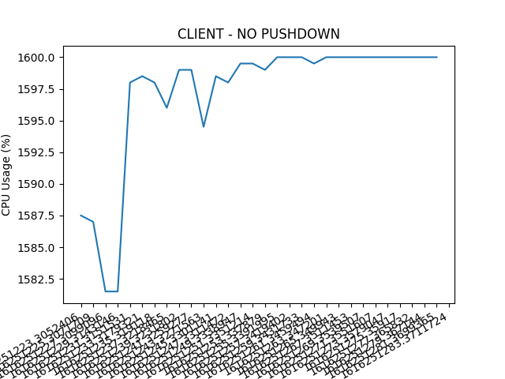
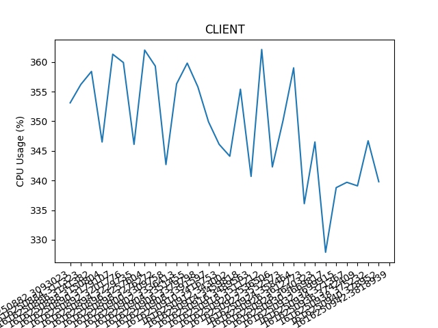
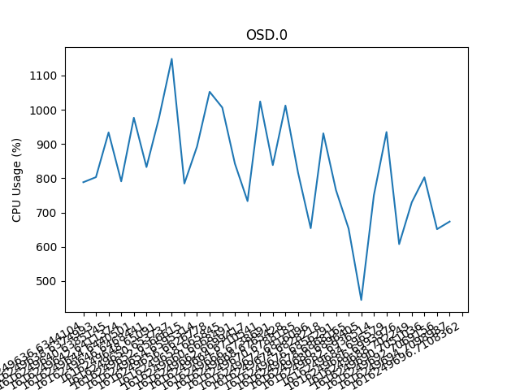
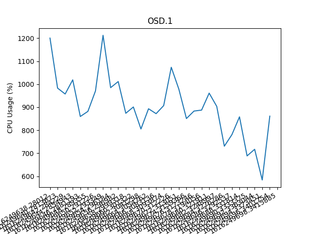
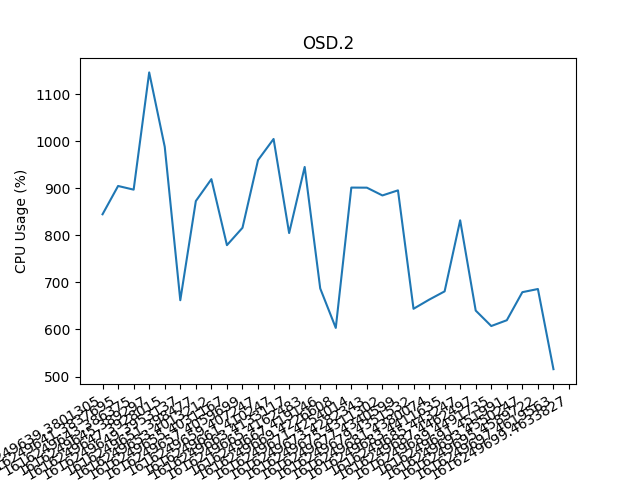
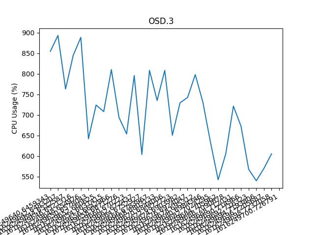

## 4 Nodes, 16 OSDs, 16 threads/osd, 256 threads on client

```
rpq_100 = [144.953458070755, 144.5628092288971, 144.63622617721558]
rpq_10 = [92.60004019737244, 94.82055115699768, 94.24415445327759]
rpq_1 = [90.3268404006958, 89.87321400642395, 89.57717204093933]
rpq_smm = [89.59809255599976, 90.24286103248596, 90.05710363388062]
```

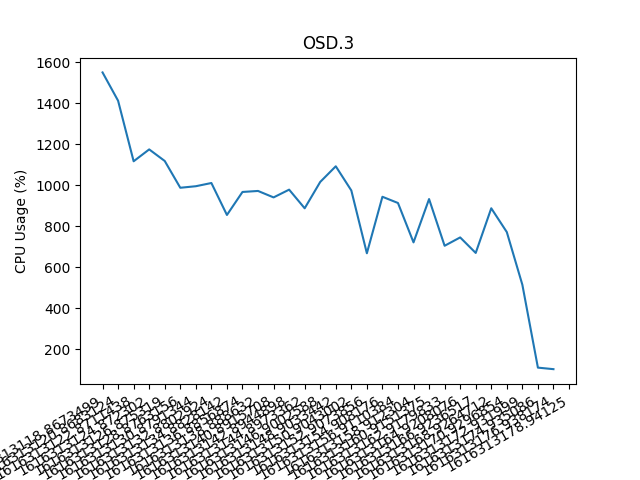


## 4 Nodes, 16 OSDs, 8 threads/osd, 128 threads on client

```
rpq_100 = [144.1752893924713, 145.06335282325745, 145.23308944702148]
rpq_smm = [83.33196902275085, 83.35774159431458, 81.18528580665588]
rpq_1 = [82.6145248413086, 82.93498802185059, 82.03883028030396]
rpq_10 = [85.31772303581238, 84.61017227172852, 84.63752317428589]
```

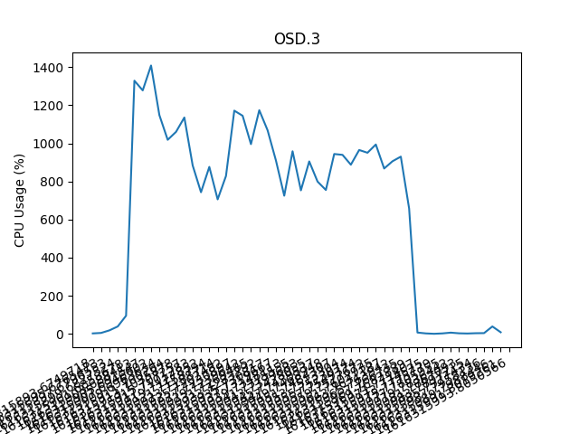

## 4 Nodes, 16 OSDs, 4 threads/osd, 64 threads on client

```
rpq_1 = [75.41930437088013, 75.51757097244263, 74.93639326095581]
rpq_10 = [78.56239748001099, 78.34686303138733, 77.06540751457214]
rpq_smm = [74.8825581073761, 74.74883723258972, 74.4597339630127]
rpq_100 = [145.16066217422485, 143.92131233215332, 145.04984307289124]
```

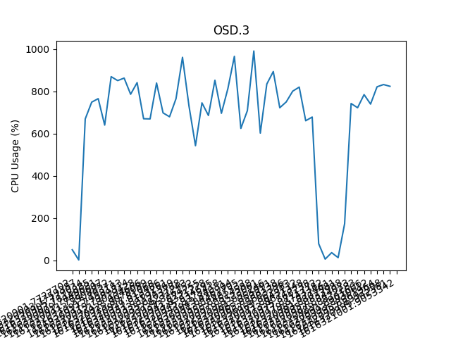

## 4 Nodes, 16 OSDs, 4 threads/osd, 128 threads on client, 4 MB Files

```
rpq_100 = [144.11271572113037, 143.91012573242188, 145.29011845588684]
rpq_smm = [70.52953290939331, 71.4922137260437, 70.10210299491882]
rpq_1 =  [70.90275382995605, 71.39026236534119, 71.42028164863586]
rpq_10 = [71.76636862754822, 73.09835386276245, 72.34029769897461]
```
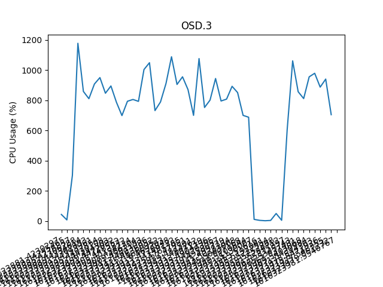

## 4 Nodes, 16 OSDs, 4 threads/osd, 128 threads on client, 16 MB Files

Running into OSD problems


## 4 Nodes, 16 OSDs, 4 threads/osd, 128 threads on client, 8 MB Files

```
pq_100 = [175.50949716567993, 174.0486752986908, 174.22482132911682]
pq_10 = [184.1578643321991, 182.59548473358154, 182.57547616958618]
pq_1 = [179.64655113220215, 178.14739441871643, 178.12083625793457]
pq_smm = [179.07610154151917, 178.4922137260437, 180.76636862754822]

rpq_100 = [181.30581307411194, 174.01922869682312, 172.99936771392822]
rpq_10 = [79.60187292098999, 80.06426501274109, 79.88764667510986]
rpq_1 = [77.02884602546692, 80.03846859931946, 77.57726716995239]
rpq_smm = [77.91960406303406, 78.57767391204834, 76.46985507011414]
```

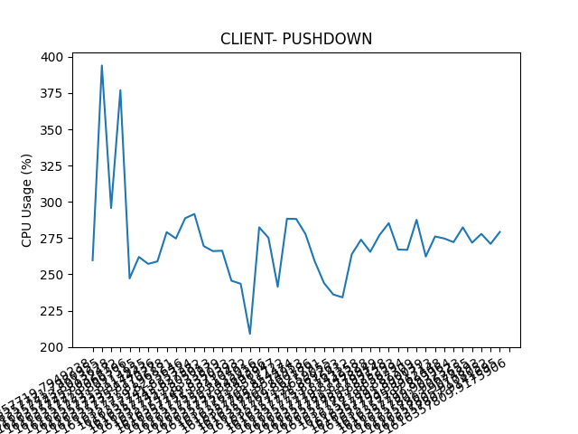
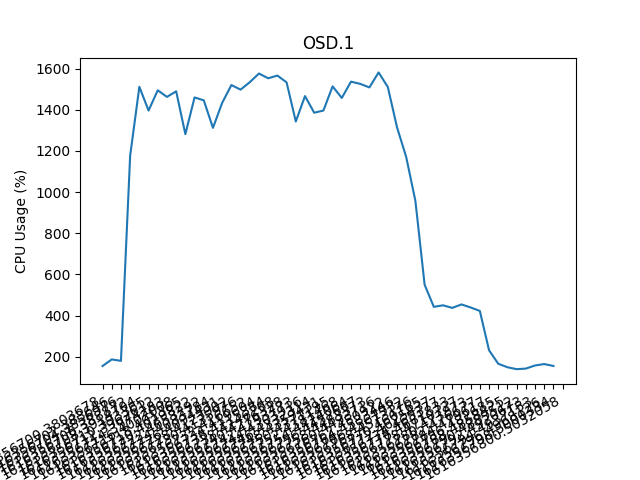
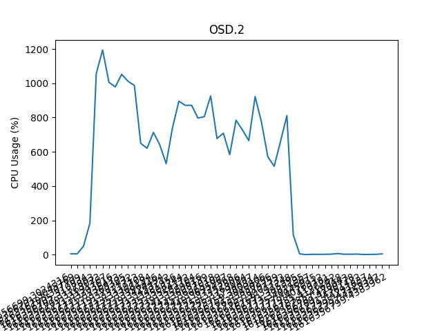
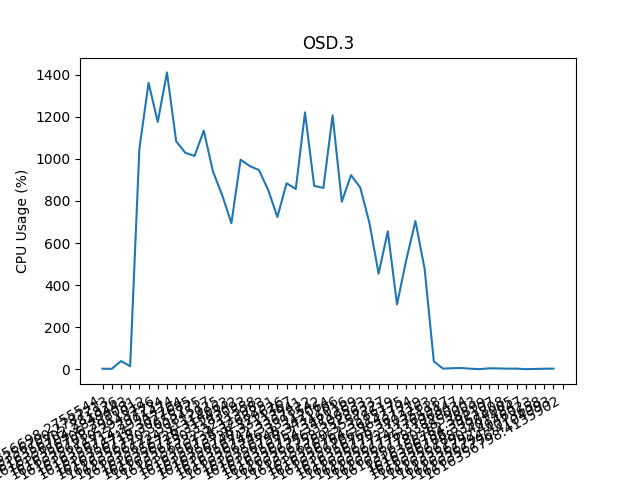
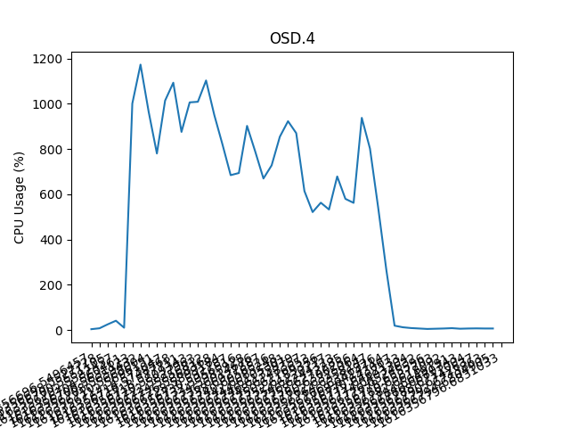

