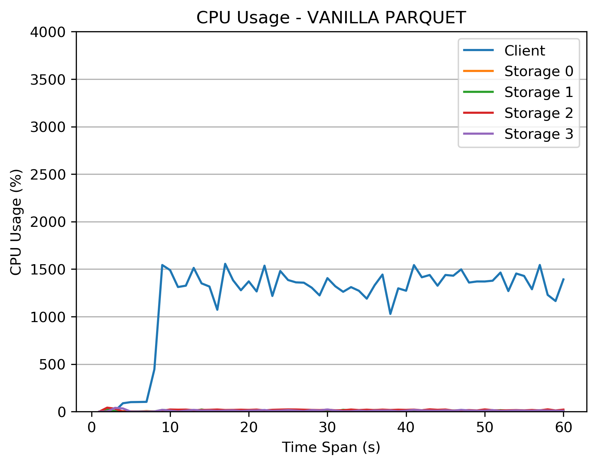
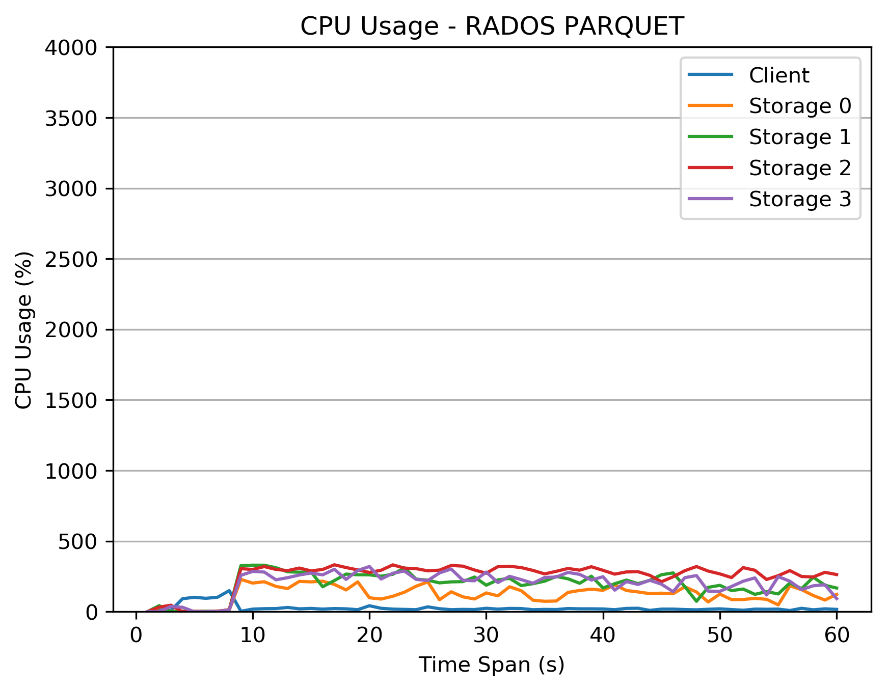
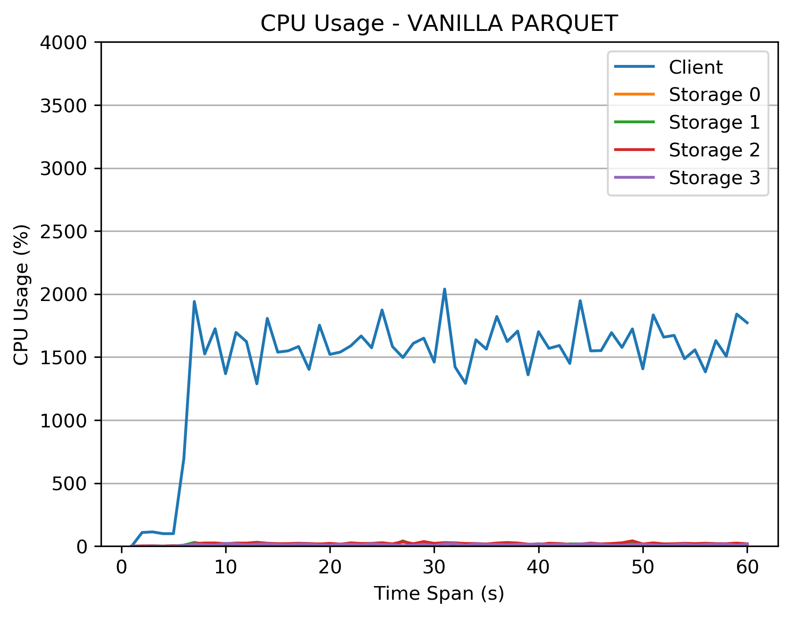
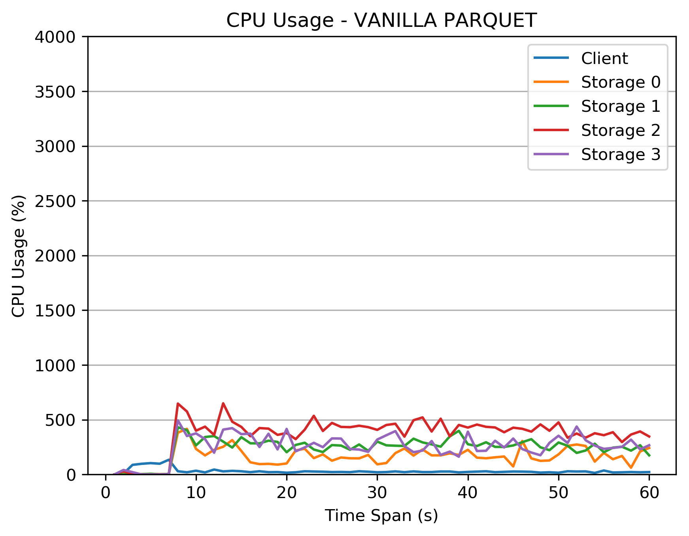
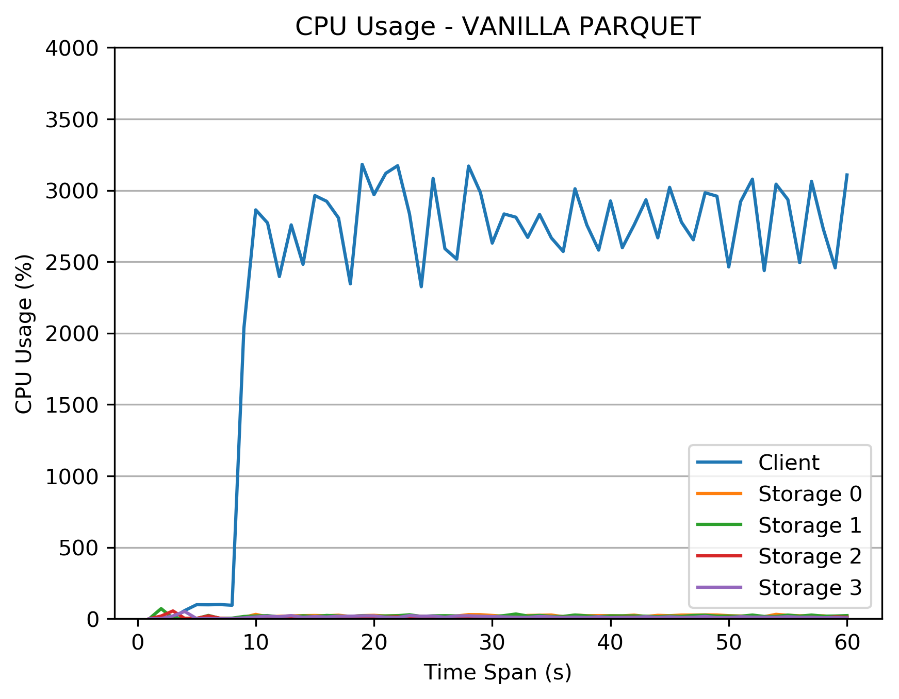
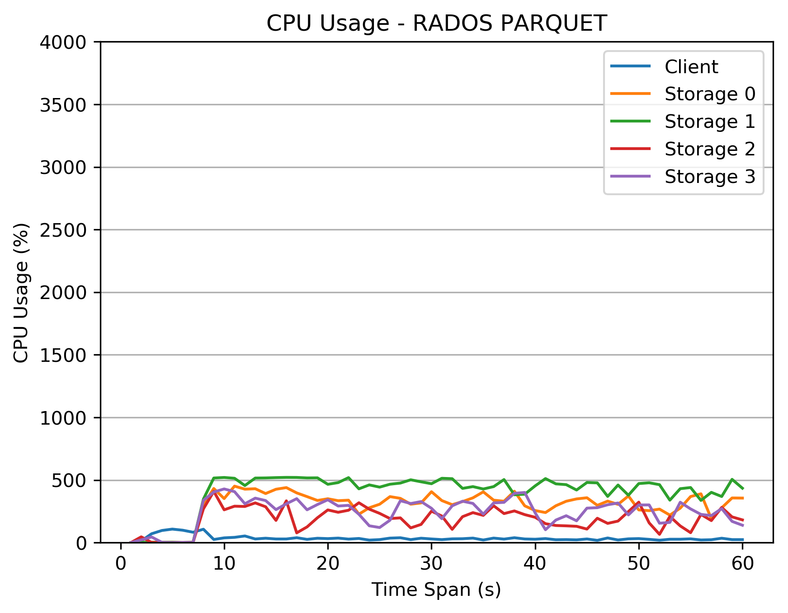
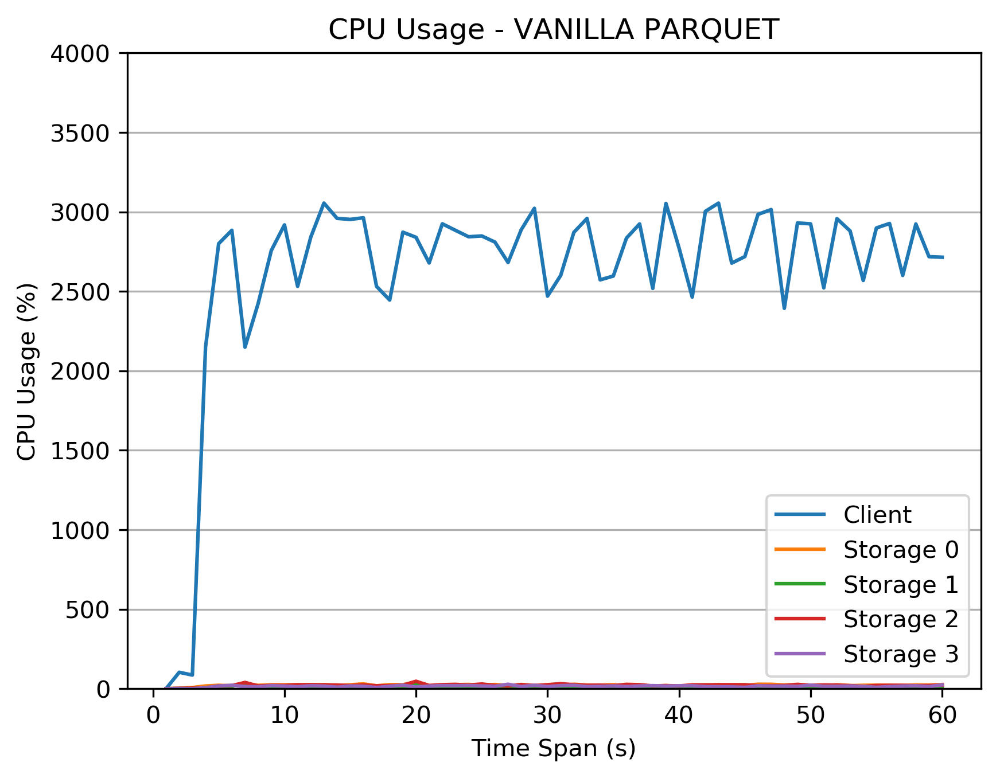
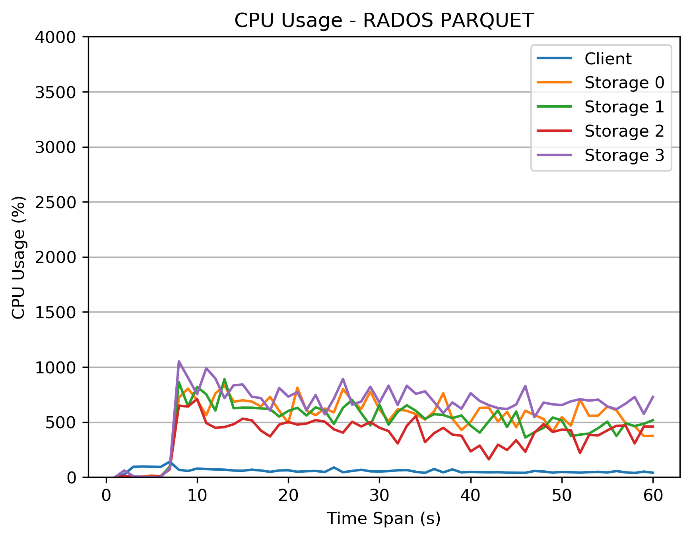

1. On HDD, 4 node, 4 osd, 40 th/osd, 160 th/client
```
pq_1 = [121.32441639900208, 120.83523535728455, 120.49775075912476]
pq_10 = [122.9134030342102, 122.76911520957947, 122.87186574935913]
pq_100 = [142.9321529865265, 143.91102933883667, 144.03269696235657]
pq_smm = [123.55038690567017]

rpq_1 = [242.3901150226593, 240.75631761550903, 241.3043053150177]
rpq_10 = [245.83927941322327]
rpq_100 = [261.7145712375641]
rpq_smm = [241.13231825828552]
```




2. On HDD and SSD, 4 node, 8 osd, 20th/osd, 160 th/client
```
pq_1 = [103.2953588962555]
rpq_1 = [183.7493553161621]
```




3. On Memory, 4 node, 4 osd, 40 th/osd, 160 th/client

```
pq_1 = [71.02495884895325]
rpq_1 = [147.00140976905823]
```




4. On Memory, 4 node, 16 osd, 10 th/osd, 160 th/client
```
pq_1 = [70.25089144706726]
rpq_1 = [92.9198796749115]
```





<!-- 4. On HDD, 4 OSDs per node
5. On Memory, 4 OSDs per node -->
