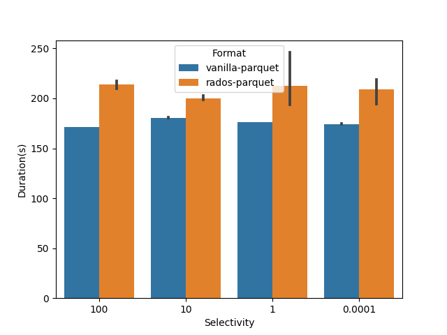
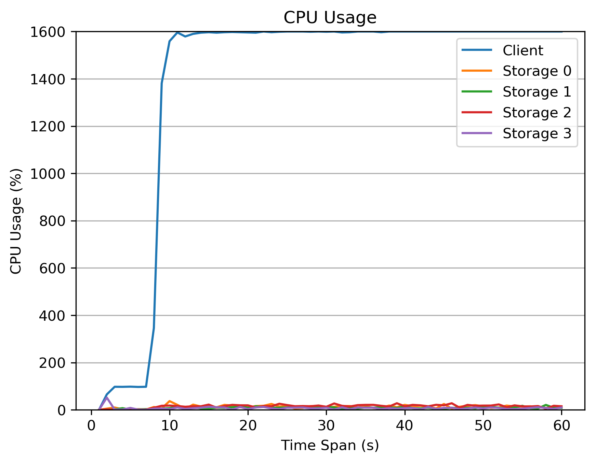
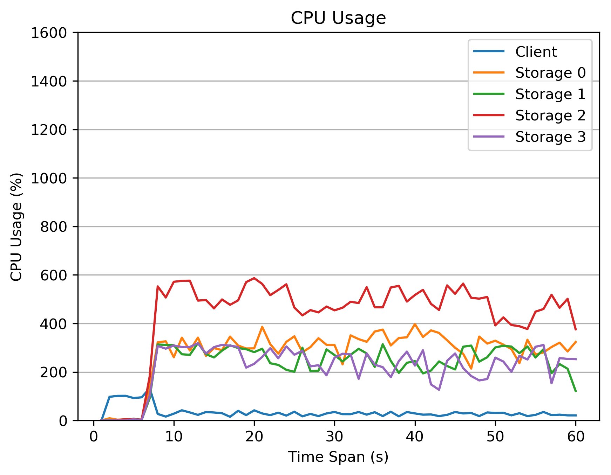

1. 4 nodes, 4 osds, 16th/osd, 64 th/client

* Latency



* CPU Usage




2. 8 nodes, 8 osds, 16 th/osd, 128 th/client

* Latency
```
rpq_100 = [188.16803884506226, 186.19433903694153]
rpq_10 = [96.80250597000122, 98.9324586391449]
rpq_1 = [93.37817430496216, 93.14924907684326]
rpq_smm = [93.95638799667358, 93.32884645462036]

pq_100 = [171.06061339378357, 171.39343428611755]
pq_10 = [181.75198650360107, 181.8396031856537]
pq_1 = [176.574857711792, 176.54409551620483]
pq_smm = [174.28278422355652, 174.36065673828125]
```

* PG Map

```
OSD_STAT  USED     AVAIL    USED_RAW  TOTAL    HB_PEERS         PG_SUM  PRIMARY_PG_SUM
7         7.6 GiB  208 GiB   8.6 GiB  216 GiB  [0,1,2,3,4,5,6]      30               6
6         7.9 GiB  208 GiB   8.9 GiB  216 GiB  [0,1,2,3,4,5,7]      32              16
5         5.8 GiB  210 GiB   6.8 GiB  216 GiB  [0,1,2,3,4,6,7]      24               5
4         8.7 GiB  207 GiB   9.7 GiB  216 GiB  [0,1,2,3,5,6,7]      35              16
3         7.2 GiB  208 GiB   8.2 GiB  216 GiB  [0,1,2,4,5,6,7]      29               9
2         8.2 GiB  207 GiB   9.2 GiB  216 GiB  [0,1,3,4,5,6,7]      34               9
1         7.8 GiB  208 GiB   8.8 GiB  216 GiB  [0,2,3,4,5,6,7]      33              11
0         6.1 GiB  209 GiB   7.1 GiB  216 GiB  [1,2,3,4,5,6,7]      26               9
sum        59 GiB  1.6 TiB    67 GiB  1.7 TiB                                         
```

* CPU Usage


3. 16 nodes, 16 osds, 16 th/osd, 256 th/client

* Latency

```
pq_100 = [171.84842371940613, 171.80615234375]
pq_10 = [181.8477156162262, 182.10683250427246]
pq_1 = [175.5687255859375, 175.2944052219391]
pq_smm = [174.65419030189514, 174.49053382873535]

rpq_100 = [188.85397744178772, 188.60990810394287]
rpq_10 = [66.07678818702698, 63.29588484764099]
rpq_1 = [61.54655075073242, 61.50921678543091]
rpq_smm = [59.91036057472229, 59.47328019142151]
```

* PG Map

```
OSD_STAT  USED     AVAIL    USED_RAW  TOTAL    HB_PEERS                               PG_SUM  PRIMARY_PG_SUM
15        3.7 GiB  212 GiB   4.7 GiB  216 GiB   [0,1,2,3,4,5,6,7,8,9,10,11,12,13,14]      13               5
14        4.6 GiB  211 GiB   5.6 GiB  216 GiB   [0,1,2,3,4,5,6,7,8,9,10,11,12,13,15]      19               7
13        3.3 GiB  212 GiB   4.3 GiB  216 GiB   [0,1,2,3,4,5,6,7,8,9,10,11,12,14,15]      14               4
0         2.3 GiB  213 GiB   3.3 GiB  216 GiB  [1,2,3,4,5,6,7,8,9,10,11,12,13,14,15]      12               3
1         3.7 GiB  212 GiB   4.7 GiB  216 GiB  [0,2,3,4,5,6,7,8,9,10,11,12,13,14,15]      17               4
2         5.1 GiB  210 GiB   6.1 GiB  216 GiB  [0,1,3,4,5,6,7,8,9,10,11,12,13,14,15]      20               7
3         3.1 GiB  212 GiB   4.1 GiB  216 GiB  [0,1,2,4,5,6,7,8,9,10,11,12,13,14,15]      15               5
4         5.0 GiB  210 GiB   6.0 GiB  216 GiB  [0,1,2,3,5,6,7,8,9,10,11,12,13,14,15]      17               8
5         2.1 GiB  213 GiB   3.1 GiB  216 GiB  [0,1,2,3,4,6,7,8,9,10,11,12,13,14,15]      10               3
6         3.9 GiB  212 GiB   4.9 GiB  216 GiB  [0,1,2,3,4,5,7,8,9,10,11,12,13,14,15]      18               9
7         3.8 GiB  212 GiB   4.8 GiB  216 GiB  [0,1,2,3,4,5,6,8,9,10,11,12,13,14,15]      16               1
8         2.5 GiB  213 GiB   3.5 GiB  216 GiB  [0,1,2,3,4,5,6,7,9,10,11,12,13,14,15]       9               3
9         5.3 GiB  210 GiB   6.3 GiB  216 GiB  [0,1,2,3,4,5,6,7,8,10,11,12,13,14,15]      17               7
10        5.4 GiB  210 GiB   6.4 GiB  216 GiB   [0,1,2,3,4,5,6,7,8,9,11,12,13,14,15]      21               7
11        2.4 GiB  213 GiB   3.4 GiB  216 GiB   [0,1,2,3,4,5,6,7,8,9,10,12,13,14,15]      11               2
12        2.8 GiB  213 GiB   3.8 GiB  216 GiB   [0,1,2,3,4,5,6,7,8,9,10,11,13,14,15]      14               6
sum        59 GiB  3.3 TiB    75 GiB  3.4 TiB                                                               
```
