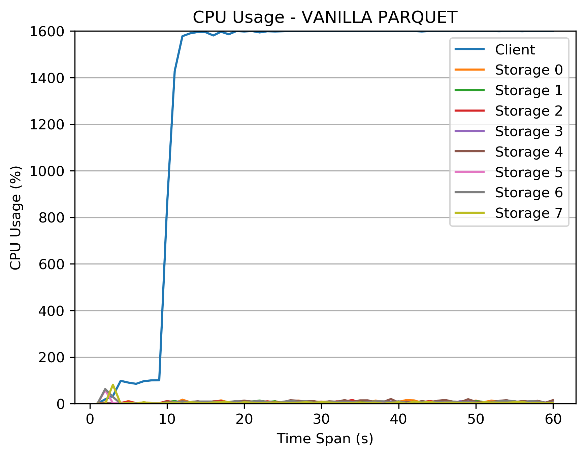
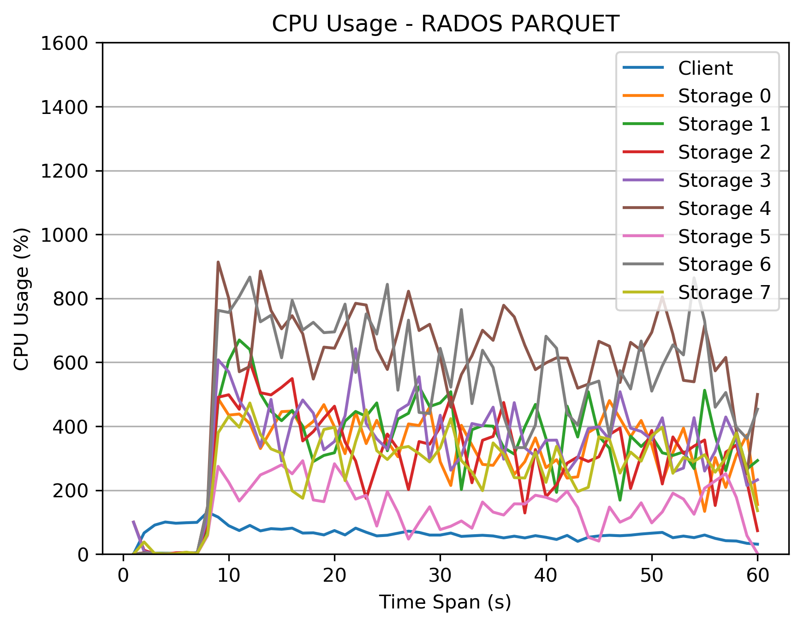

2. 8 nodes, 8 osds, 16 th/osd, 128 th/client

* Latency
```
rpq_100 = [188.16803884506226, 186.19433903694153]
rpq_10 = [96.80250597000122, 98.9324586391449]
rpq_1 = [93.37817430496216, 93.14924907684326]
rpq_smm = [93.95638799667358, 93.32884645462036]

pq_100 = [171.06061339378357, 171.39343428611755]
pq_10 = [181.75198650360107, 181.8396031856537]
pq_1 = [176.574857711792, 176.54409551620483]
pq_smm = [174.28278422355652, 174.36065673828125]
```

* PG Map

```
OSD_STAT  USED     AVAIL    USED_RAW  TOTAL    HB_PEERS         PG_SUM  PRIMARY_PG_SUM
7         7.6 GiB  208 GiB   8.6 GiB  216 GiB  [0,1,2,3,4,5,6]      30               6
6         7.9 GiB  208 GiB   8.9 GiB  216 GiB  [0,1,2,3,4,5,7]      32              16
5         5.8 GiB  210 GiB   6.8 GiB  216 GiB  [0,1,2,3,4,6,7]      24               5
4         8.7 GiB  207 GiB   9.7 GiB  216 GiB  [0,1,2,3,5,6,7]      35              16
3         7.2 GiB  208 GiB   8.2 GiB  216 GiB  [0,1,2,4,5,6,7]      29               9
2         8.2 GiB  207 GiB   9.2 GiB  216 GiB  [0,1,3,4,5,6,7]      34               9
1         7.8 GiB  208 GiB   8.8 GiB  216 GiB  [0,2,3,4,5,6,7]      33              11
0         6.1 GiB  209 GiB   7.1 GiB  216 GiB  [1,2,3,4,5,6,7]      26               9
sum        59 GiB  1.6 TiB    67 GiB  1.7 TiB                                         
```

* CPU Usage



